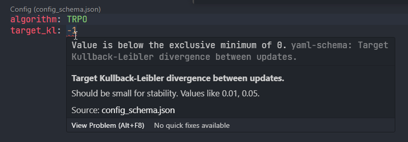
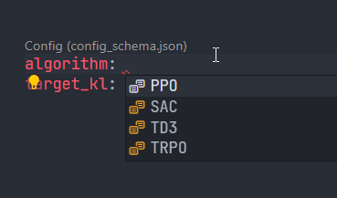

# Expedantic

[](https://pypi.python.org/pypi/expedantic)
[](https://www.python.org/downloads/release/python-3100/)

## Installation

```
pip install expedantic
```

## Basic Usage

```python
from expedantic import ConfigBase

# Define a config model
class MyConfig(ConfigBase):
    device: str = 'cuda:0'
    learning_rate: float = 1.0e-3
    num_epochs: int = 100

# Save and load from yaml files
my_config = MyConfig()
my_config.save_as_yaml("config.yaml")
my_config = MyConfig.load_from_yaml("config.yaml")


# For a given function or class,
def learn(device: str, learning_rate: float, num_epochs: int):
    ...

# Consume the config by getting kwargs automatically.
learn(**my_config.compatible_args(learn))


# Or pass manually
learn(my_config.device, my_config.learning_rate, my_config.num_epochs)
```

### Examples

Find some examples [here](./examples/).


## Features

- Type validation using `pydantic`.

- JSON schema generation for autocompletion on yaml files.
    You can facilitate efficient yaml editing on IDEs such as [VS Code](https://code.visualstudio.com/).
    
    For the VS Code usage, the following steps enable the autocompletion on yaml files for configuration models.

    1. Generate a schema.

    ```python
    from pathlib import Path
    from typing import Annotated, Literal
    from expedantic import ConfigBase, Field


    class Config(ConfigBase):
        algorithm: Literal["TRPO", "PPO", "SAC", "TD3"] = "TRPO"
        target_kl: Annotated[
            float,
            Field(
                title="Target Kullback-Leibler divergence between updates.",
                description="Should be small for stability. Values like 0.01, 0.05.",
                gt=0.0,
            ),
        ] = 0.01


    config = Config()
    Path("configs").mkdir(exist_ok=True)
    config.save_as_yaml("configs/config.yaml")
    Config.generate_schema("schemas/config_schema.json")
    ```

    2. Install [the yaml language extension](https://marketplace.visualstudio.com/items?itemName=redhat.vscode-yaml).

    3. Associating the schema
    ```json
     .vscode/settings.json
    yaml.schemas: {
        "schemas/config_schema.json": "configs/config.yaml",
    }
    ```
    Check the further rules for association in [the description of the extension](https://marketplace.visualstudio.com/items?itemName=redhat.vscode-yaml).

    4. Enjoy!
    
    


- Integrated argument parser with supporting nested key access:
    ```python
    # run.py
    class MyInnerConfig(ConfigBase):
        inner_key: str = "inner_value"
    class MyConfig(ConfigBase):
        inner_config: MyInnerConfig = MyInnerConfig()
        outer_key: int = 10


    my_config = MyConfig.parse_args()
    ```
    ```shell
    python run.py --inner_config.inner_key "another inner value" --outer_key 20
    ```

- `!include` directive support for yaml files:
    ```yaml
    # base.yaml
    learning_rate: 3.0e-5
    num_epochs: 10
    device: cpu
    ```
    ```yaml
    # derived.yaml
    <<: !include base.yaml
    device: cuda
    extra: True
    ```

    The content of `derived.yaml` is equivalent to the following:
    ```yaml
    learning_rate: 3.0e-5
    num_epochs: 10
    device: cuda
    extra: True
    ```

- Mutually exclusive configuration groups:

    ```python
    from pydantic import ValidationError


    class Config(ConfigBase):
        _mutually_exclusive_sets = [{"make_algorithm_A_obsolete", "use_algorithm_A"}]

        make_algorithm_A_obsolete: bool = True
        use_algorithm_A: bool = False

    try:
        config = Config(make_algorithm_A_obsolete=True, use_algorithm_A=True)
    except ValidationError as e:
        print(e)
        """
        1 validation error for Config
            Value error, Mutual exclusivity has broken. (set: {'make_algorithm_A_obsolete', 'use_algorithm_A'}) [type=value_error, input_value={'make_algorithm_A_obsolete': True, 'use_algorithm_A': True}, input_type=dict]
        """

    ```


