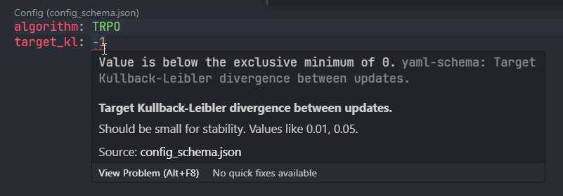
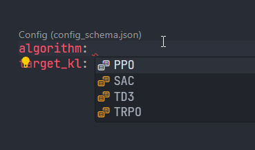

# Expedantic

[](https://pypi.python.org/pypi/expedantic)
[](https://www.python.org/downloads/release/python-3100/)

## Installation

The repository currently contains newer functionality than the published PyPI
package. For the time being, install Expedantic from a source checkout:

```shell
git clone --recurse-submodules https://github.com/rnilva/expedantic.git
cd expedantic
python -m pip install --editable .
```

The config parser and the logger both work with this base install. DataFrame
export (`LoggerBase.to_dataframe()` and `.save()`) additionally needs Polars:

```shell
python -m pip install --editable ".[dataframe]"
```

## Basic Usage

```python
from expedantic import ConfigBase

# Define a config model
class MyConfig(ConfigBase):
    device: str = 'cuda:0'
    learning_rate: float = 1.0e-3
    num_epochs: int = 100

# Save and load from yaml files
my_config = MyConfig()
my_config.save_as_yaml("config.yaml")
my_config = MyConfig.load_from_yaml("config.yaml")


# For a given function or class,
def learn(device: str, learning_rate: float, num_epochs: int):
    ...

# Consume the config by getting kwargs automatically.
learn(**my_config.compatible_args(learn))


# Or pass manually
learn(my_config.device, my_config.learning_rate, my_config.num_epochs)
```

### Examples

Find some examples [here](./examples/).


## Features

- Type validation using `pydantic`.

- JSON schema generation for autocompletion on yaml files.
    You can facilitate efficient yaml editing on IDEs such as [VS Code](https://code.visualstudio.com/).
    
    For the VS Code usage, the following steps enable the autocompletion on yaml files for configuration models.

    1. Generate a schema.

    ```python
    from pathlib import Path
    from typing import Annotated, Literal
    from expedantic import ConfigBase, Field


    class Config(ConfigBase):
        algorithm: Literal["TRPO", "PPO", "SAC", "TD3"] = "TRPO"
        target_kl: Annotated[
            float,
            Field(
                title="Target Kullback-Leibler divergence between updates.",
                description="Should be small for stability. Values like 0.01, 0.05.",
                gt=0.0,
            ),
        ] = 0.01


    config = Config()
    Path("configs").mkdir(exist_ok=True)
    config.save_as_yaml("configs/config.yaml")
    Config.generate_schema("schemas/config_schema.json")
    ```

    2. Install [the yaml language extension](https://marketplace.visualstudio.com/items?itemName=redhat.vscode-yaml).

    3. Associating the schema
    ```json
     .vscode/settings.json
    yaml.schemas: {
        "schemas/config_schema.json": "configs/config.yaml",
    }
    ```
    Check the further rules for association in [the description of the extension](https://marketplace.visualstudio.com/items?itemName=redhat.vscode-yaml).

    4. Enjoy!
    
    


- Integrated argument parser with supporting nested key access:
    ```python
    # run.py
    class MyInnerConfig(ConfigBase):
        inner_key: str = "inner_value"
    class MyConfig(ConfigBase):
        inner_config: MyInnerConfig = MyInnerConfig()
        outer_key: int = 10


    my_config = MyConfig.parse_args()
    ```
    ```shell
    python run.py --inner_config.inner_key "another inner value" --outer_key 20
    ```

    Boolean fields accept every conventional spelling: `--flag` (true), `--no-flag` (false),
    `--flag true|false|1|0|yes|no` (and `t/f/y/n`), and `--flag=false`. An unrecognised value
    fails with a message naming the accepted forms. With `require_default_file=True`, put the
    config-file path before any bare `--flag` (a bare flag would otherwise try to consume the
    path as its value, and fail loudly).

- Configuration provenance — layered diffs. With a config file
  (`parse_args(require_default_file=True)`), the printed diff splits into one tree per layer:
  `defaults → config file` (how the committed file deviates from the schema defaults) and
  `config file → CLI overrides` (how *this invocation* deviates from the file). A captured
  stdout log therefore records exactly how each run differed from its committed configuration —
  per-run provenance for free. Use `diff_print_mode="tree_skip"` for the most compact form:
    ```shell
    python run.py configs/cell_a.yaml --train.iters 1200
    # prints two diff trees (schematically):
    #   📦 Config — config file      tag: 'run' → 'cell_a', train.lrm: 0.5 → 0.25
    #   📦 Config — CLI overrides    train.iters: 2400 → 1200
    ```

- `!include` directive support for yaml files:
    ```yaml
    # base.yaml
    learning_rate: 3.0e-5
    num_epochs: 10
    device: cpu
    ```
    ```yaml
    # derived.yaml
    <<: !include base.yaml
    device: cuda
    extra: True
    ```

    The content of `derived.yaml` is equivalent to the following:
    ```yaml
    learning_rate: 3.0e-5
    num_epochs: 10
    device: cuda
    extra: True
    ```

- Mutually exclusive configuration groups:

    ```python
    from pydantic import ValidationError


    class Config(ConfigBase):
        _mutually_exclusive_sets = [{"make_algorithm_A_obsolete", "use_algorithm_A"}]

        make_algorithm_A_obsolete: bool = True
        use_algorithm_A: bool = False

    try:
        config = Config(make_algorithm_A_obsolete=True, use_algorithm_A=True)
    except ValidationError as e:
        print(e)
        """
        1 validation error for Config
            Value error, Mutual exclusivity has broken. (set: {'make_algorithm_A_obsolete', 'use_algorithm_A'}) [type=value_error, input_value={'make_algorithm_A_obsolete': True, 'use_algorithm_A': True}, input_type=dict]
        """

    ```

## Logger Module

Expedantic now includes a comprehensive type-safe logging framework designed for machine learning training loops and data collection scenarios.

### Logger Features

- **Type-safe field system** with 8 different field types for various aggregation patterns
- **Automatic timestamping** for all log entries  
- **Field reset** after flush to prevent data leakage between entries
- **DataFrame export** capabilities with Polars integration (optional `dataframe` extra)
- **Input validation** and comprehensive error handling

### Field Types

- `Field[T]`: Stores the last logged value
- `MeanField`: Computes average of all logged values  
- `MaxField`/`MinField`: Tracks maximum/minimum value across all logs
- `SumField`: Accumulates all logged values
- `ListField`: Collects all logged values in a list
- `CountField`: Counts occurrences (ignores actual values)
- `StdField`/`MedianField`: Computes statistical measures

### Basic Logger Usage

```python
from expedantic.logger import LoggerBase, Field, MeanField, MaxField

# Define a custom logger
class MyLogger(LoggerBase):
    iteration: Field[int]
    loss: MeanField
    accuracy: MaxField[float]

# Use the logger
logger = MyLogger()
logger.iteration.log(1)
logger.loss.log(0.5)
logger.accuracy.log(0.95)

# Flush computes aggregations and stores entry
entry = logger.flush()
print(entry)  # {'iteration': 1, 'loss': 0.5, 'accuracy': 0.95, '_timestamp': datetime(...)}

# Export to DataFrame
df = logger.to_dataframe()
logger.save("data.ipc")  # Save to file
```

### Training Loop Example

```python
import numpy as np
from expedantic.logger import LoggerBase, Field, MeanField, MaxField, SumField, ListField

class TrainingLogger(LoggerBase):
    """Logger for machine learning training loops."""
    
    iteration: Field[int]           # Current training iteration
    epoch: Field[int]               # Current epoch number
    loss: MeanField                 # Average training loss per epoch
    val_loss: MeanField             # Average validation loss per epoch  
    learning_rate: Field[float]     # Current learning rate
    messages: ListField[str]        # Collected log messages
    accuracy: MaxField[float]       # Best accuracy achieved in epoch
    batch_time: SumField[float]     # Total time spent on batches

# Realistic training loop usage
logger = TrainingLogger()

for epoch in range(3):
    logger.epoch.log(epoch)
    
    # Training phase
    for batch in range(10):
        logger.iteration.log(epoch * 10 + batch)
        
        # Simulate batch metrics (will be reduced)
        logger.loss.log(0.5 - epoch * 0.1 + np.random.normal(0, 0.05))
        logger.batch_time.log(0.1 + np.random.random() * 0.05)
    
    # Validation phase
    for val_batch in range(3):
        logger.val_loss.log(0.4 - epoch * 0.05 + np.random.normal(0, 0.03))
        logger.accuracy.log(0.7 + epoch * 0.1 + np.random.normal(0, 0.02))
    
    logger.messages.log(f"Epoch {epoch} complete")
    logger.learning_rate.log(0.001 * (0.9**epoch))
    
    # Flush computes all reductions
    entry = logger.flush()
    
    print(f"Epoch {epoch}:")
    print(f"  Loss: {entry['loss']:.4f} (avg of 10 batches)")
    print(f"  Val Loss: {entry.get('val_loss', 0):.4f} (avg of 3 batches)")
    print(f"  Best Accuracy: {entry.get('accuracy', 0):.4f}")
    print(f"  Total Time: {entry.get('batch_time', 0):.2f}s")

# Export results
df = logger.to_dataframe()
print(df)
```

### Simple Logger Example

```python
from expedantic.logger import LoggerBase, Field, MeanField
import numpy as np

class SimpleLogger(LoggerBase):
    """Minimal logger for quick experiments."""
    
    step: Field[int]
    value: MeanField

logger = SimpleLogger()

for i in range(100):
    logger.step.log(i)
    logger.value.log(np.sin(i * 0.1) + np.random.normal(0, 0.1))
    
    if (i + 1) % 10 == 0:
        entry = logger.flush()
        print(f"Step {entry['step']}: avg={entry['value']:.3f}")
```

